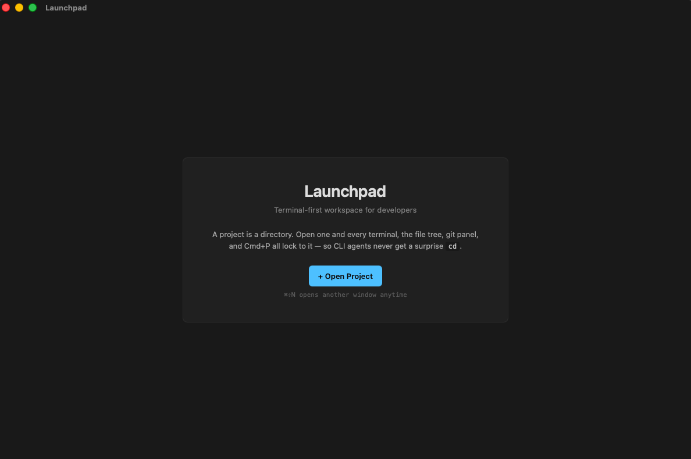
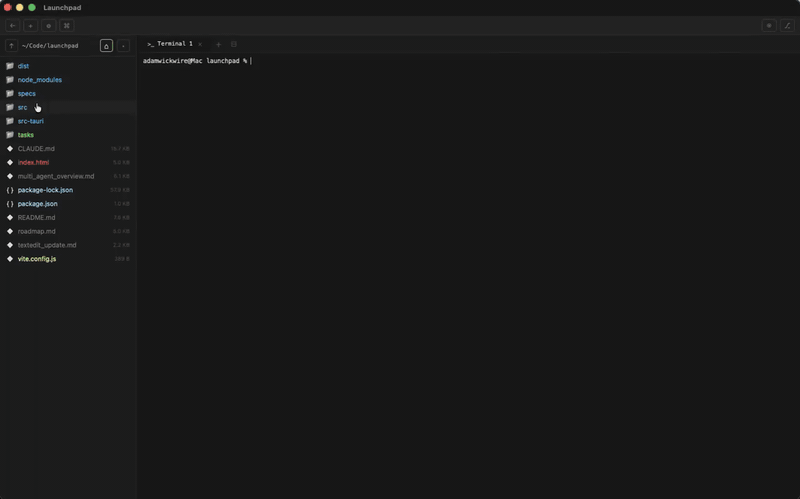
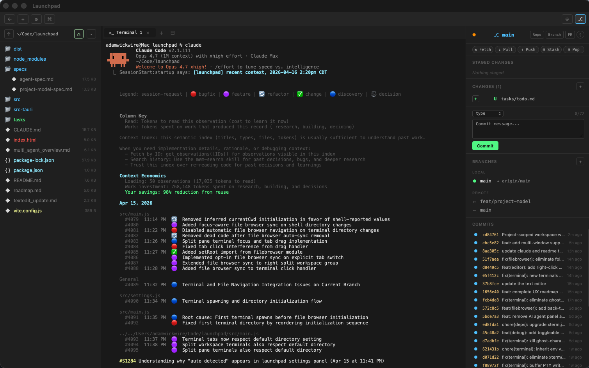

# Launchpad

A terminal-first macOS workspace. Terminal, file browser, git panel, and a git-aware code editor — scoped to one project per window.

  

**Docs:** [walrusquant.github.io/launchpad](https://walrusquant.github.io/launchpad/) — landing, getting started, features, shortcuts, architecture.



## What is this?

A desktop app I built because I wanted a comfortable place to run Claude Code and other CLI coding agents. I spend most of my time in the terminal now, and I wanted the rest of the workflow — file tree, git, the occasional file edit — wrapped around it in a way that felt natural to me.

## Why I made it

I wasn't trying to reinvent anything or prove a point. I just wanted a tool that fit how I actually code with CLI agents. Open a project, have a terminal ready, click around files without worrying about accidentally breaking something in the shell, commit stuff without remembering git flags. That's it.

I told Claude I wanted to build a desktop app. It suggested Tauri + Rust + vanilla JS. I said sounds good, we'll figure it out. This is what we figured out.





## Install

### Download (easiest)

Grab the latest `.dmg` from [Releases](https://github.com/WalrusQuant/launchpad/releases/latest). Apple Silicon only for now.

1. Open the DMG, drag `Launchpad.app` to `/Applications`
2. Double-click to launch. The app is code-signed and notarized by Apple, so no Gatekeeper warning or `xattr` workaround is needed.

### From source
```bash
# Prerequisites: Rust, Node.js
curl --proto '=https' --tlsv1.2 -sSf https://sh.rustup.rs | sh

# Clone and build
git clone https://github.com/WalrusQuant/launchpad.git
cd launchpad
npm install
npx tauri build

# Install
cp -R src-tauri/target/release/bundle/macos/Launchpad.app /Applications/
```

### Development
```bash
npm install
npx tauri dev
```

## Features

### Projects
Launchpad is organized around **projects** — a project is just a root directory. When you open one, every terminal spawned in that window starts at the project root, the file browser is locked there, and the git panel operates on that repo. Cmd+P fuzzy-search stays inside the project. This means you can run a CLI agent like `claude` or `aider` in a terminal tab and click around the file tree without ever sending a stray `cd` to the shell — the file browser is purely visual.

- **One window = one project.** Opening a project in the picker takes over the current window (VS Code convention). Already-open projects get focused if you try to open them again.
- **Multi-window on demand.** Cmd+Shift+N opens a fresh project picker so you can open a second project in parallel. Each window is fully independent.
- **Picker with recents.** Projects are stored at `~/.launchpad/projects.json`. Right-click (or the ⋯ hover menu) to rename, open in a new window, or remove from the list.
- **Back to projects** — a `←` button in the toolbar tears down the workspace and returns to the picker.

### Terminal
Full PTY-backed terminal with tabs, split panes, and a split workspace. Spawns real zsh/bash processes with proper signal handling, 256-color support, and correct escape sequences.

- Multiple tabs (Cmd+T / Cmd+W / Cmd+1-9)
- Split pane within a tab (Cmd+D) with draggable divider
- Split workspace into left/right groups (Cmd+\\) — each group gets its own tab bar
- Drag tabs between groups or move with Cmd+Shift+M
- Switch focus between groups with Cmd+Option+Left/Right
- Clear screen (Cmd+K)
- Right-click context menu with Copy, Paste, Clear
- Drag files from sidebar to paste paths
- Configurable font, size, cursor style, scrollback
- WebGL-accelerated rendering with canvas fallback
- Unicode 11 width tables for correct CJK/emoji rendering
- Backpressure flow control prevents xterm.js write queue overflow

### Code Editor
Files open as tabs alongside your terminal tabs — one unified tab bar. Click a file in the sidebar or use Cmd+P, and it opens in a full CodeMirror 6 editor. Lean by default; the heavier features are opt-in, so it stays out of the way until you want them.

**Editing**
- Syntax highlighting for JS, TS, JSX, TSX, Python, Rust, HTML, CSS, JSON, Markdown, SCSS, TOML, YAML, Shell
- Find and replace (Cmd+F / Cmd+H)
- Bracket matching, close brackets, code folding, indent guides
- Autocompletion, highlight selection matches, rectangular selection, crosshair cursor
- File path breadcrumb + line/column status bar (click to toggle line endings, tab size, word wrap)
- Modified indicator, unsaved-changes warning on close, right-click context menu
- Optional vim mode
- Save with Cmd+S

**Git-aware**
- **Change gutter** — a per-line bar showing what changed vs HEAD (added / modified / deleted), matching the file-tree colors
- **Hunk navigation** — jump between changed hunks with Alt+J / Alt+K
- **Inline hunk actions** — click a gutter marker to **Revert hunk** (restore HEAD content) or **Stage file**
- **Blame** — a status-bar toggle reveals a margin with short commit + age per line; click to open that commit's diff
- **Inline conflict editor** — Accept Ours / Theirs / Both above each conflict block; auto-stages when resolved (see Git Panel)

**Navigation & intelligence**
- **Symbol outline** (Cmd+Shift+O) — fuzzy palette of the file's functions / classes / methods / headings, from the syntax tree (and upgraded to the language server's richer list when enabled)
- **Reveal active file in tree** (opt-in) — keep the sidebar synced to the file you're editing
- **Language server** (opt-in, off by default) — flip it on and the editor connects to `typescript-language-server`, `rust-analyzer`, or `pyright` for real diagnostics, completion, hover, signature help, go-to-definition, rename, and find-references. No servers run until you ask for them.
- **Format on save** (opt-in) — runs prettier / rustfmt / black / gofmt / shfmt on the file you saved

### Git Panel
Open with Cmd+G. A visual git workflow designed so you never have to remember git commands. Stage, commit, push, pull, stash, merge, create branches, amend, cherry-pick, rebase — all from buttons.

- **Quick actions toolbar** — Pull, Push, Fetch, Stash, Pop in one click
- **Staged vs unstaged split** — clear separation of what's going into your commit
- **Stage / unstage / discard** — per-file buttons with confirmation on destructive actions
- **Commit form** — multi-line textarea with conventional commit prefix dropdown (feat/fix/chore/...) and character counter
- **Amend** — `Amend (with staged)` reuses the index, `Amend message only` keeps the existing tree. Both prompt before rewriting a commit that's already on a remote.
- **Cherry-pick onto HEAD** — right-click a commit → cherry-pick. Conflicts route through the Pending Operation banner with Continue / Abort.
- **Interactive rebase** — right-click a commit → "Rebase from here…" opens a dedicated rebase tab. Drag commits to reorder, choose `pick / reword / squash / fixup / drop / edit` per row, then Apply. Conflicts pause the rebase, open the conflicted file inline, and surface Continue / Skip / Abort on the Pending Operation banner. Every interactive rebase creates a backup tag (`rebase-backup-<branch>-<timestamp>`) so you can recover from a bad rewrite.
- **Pending Operation banner** — when a merge / cherry-pick / rebase is paused, the banner shows the operation kind, current step / total steps (rebase), and the relevant Continue / Skip / Abort buttons. Single source of truth for "what state is git in?"
- **Branch management** — create, switch, delete, merge branches. View local and remote branches with last commit info
- **Commit history** — last 30 commits with OID, message, author, and timestamp. Click to expand and see changed files with +/- line counts. Right-click for: Compare with HEAD / parent / arbitrary ref, Cherry-pick onto HEAD, Rebase from here, Copy OID.
- **Compare two refs** — Compare with… opens a dedicated diff tab showing every changed file between the two refs, with full hunks and +/- counts.
- **Diff preview** — click any changed file to see a structured diff with line numbers and hunk headers
- **Inline conflict editor** — open a conflicted file and the editor renders an action bar above each conflict block with Accept Ours / Theirs / Both. Save when all blocks are resolved → file auto-stages and the panel updates.
- **3-pane merge tab** — for tougher conflicts, click Open 3-Way to see ours / merged / theirs side by side. Side panes are read-only; the center pane is editable with synchronized line-aligned scrolling. Save → auto-stages.
- **GitHub integration** — Open Repo, Open Branch, and Create PR buttons (auto-detected from your remote URL)
- **Stash management** — save, pop, apply, and drop stashes
- **Git cheatsheet** — hit `?` for a plain-English explanation of git concepts
- **Auto-push with upstream** — first push to a new branch automatically sets up tracking
- **Cancellable network ops** — push, pull, fetch, merge can be cancelled mid-operation, even on a stalled TCP connection
- **HTTPS-safe defaults** — no interactive credential prompts (they'd hang forever in a GUI app with no TTY); SSH agent socket forwarded even when launched from Finder
- **Ahead/behind indicators** — see how your branch compares to remote at a glance

### File Browser
- Tree view with expandable directories, rooted at the project directory
- Color-coded by file type (JS=yellow, Python=green, Rust=pink, config=cyan) and git status (modified=yellow, new=green, deleted=red, staged=green, conflict=pink)
- **Agent-safe** — navigating folders NEVER writes anything to a terminal. Browse freely while a CLI agent runs without risk of sending a surprise `cd`.
- **Root-locked** — nav-up `↑` caps at the project root (can't escape above it), go-home `⌂` jumps back to the root from any depth
- **CRUD operations** — right-click to create new files/folders, rename, delete, and reveal in Finder
- **Live filesystem watcher** — files created, modified, or deleted from the terminal or externally appear instantly in the tree (no manual refresh needed)
- **Follows external renames** — rename a file in Finder or via `mv` and the open editor tab follows it automatically (Unix inode match); deleted files get a stale-tab marker so Cmd+S can't silently write to a vanished path
- **Off-DOM tree building** — folder expansion is flicker-free thanks to detached DOM fragment rendering
- Click to open in editor, double-click folder to navigate
- Drag files to terminal to paste the path
- Right-click: copy path, copy name, reveal in Finder
- Search/filter with Cmd+F
- Toggle hidden files
- Resizable sidebar

### Quick Open (Cmd+P)
Fuzzy file search across your project. Case-insensitive, ranked by path length. Skips hidden dirs, node_modules, target, and other noise. Arrow keys to navigate, Enter to open as editor tab.

### Settings (Cmd+,)
All preferences in one place, applied live:

- **General** — sidebar width
- **Terminal** — font family (SF Mono, Menlo, Fira Code, JetBrains Mono...), font size, scrollback, cursor style, cursor blink
- **Editor** — font size, tab size, word wrap, vim mode, indent guides, format on save, reveal active file in tree, language server
- **Git** — auto-refresh interval, default commit prefix

Settings saved to `~/.launchpad/config.json`. Project list saved to `~/.launchpad/projects.json`.

### Toolbar
A compact header bar with quick access to:
- ← Back to projects (close current workspace, return to picker)
- + New window (Cmd+Shift+N)
- ⚙ Settings
- ⌘ Keyboard shortcuts reference (hover to see all shortcuts)
- ⎇ Git panel toggle

## Keyboard Shortcuts

| Shortcut | Action |
|----------|--------|
| Cmd+Shift+N | New window (opens a fresh project picker) |
| Cmd+T | New terminal tab |
| Cmd+W | Close current tab |
| Cmd+1-9 | Switch to tab N |
| Cmd+D | Split/unsplit terminal pane |
| Cmd+\\ | Split/unsplit workspace (left/right groups) |
| Cmd+Option+Left/Right | Switch focus between groups |
| Cmd+Shift+M | Move tab to other group |
| Cmd+K | Clear terminal |
| Cmd+P | Quick open (fuzzy file search) |
| Cmd+Shift+O | Go to symbol in current file |
| Cmd+G | Toggle git panel |
| Cmd+F | Find in editor / search sidebar |
| Cmd+H | Find and replace in editor |
| Alt+J / Alt+K | Jump to next / previous changed hunk (editor) |
| Cmd+S | Save file in editor |
| Cmd+, | Open settings |
| Escape | Close diff preview / dialog |

## Tech Stack

| Layer | Technology |
|-------|-----------|
| Desktop shell | Tauri v2 |
| Backend | Rust — PTY via portable-pty, git via libgit2 + system git for network ops |
| Frontend | Vanilla JS |
| Terminal | xterm.js 6 with WebGL renderer + Unicode 11 |
| Editor | CodeMirror 6 |
| Bundler | Vite |

## License

Apache 2.0 — see [LICENSE](LICENSE).
